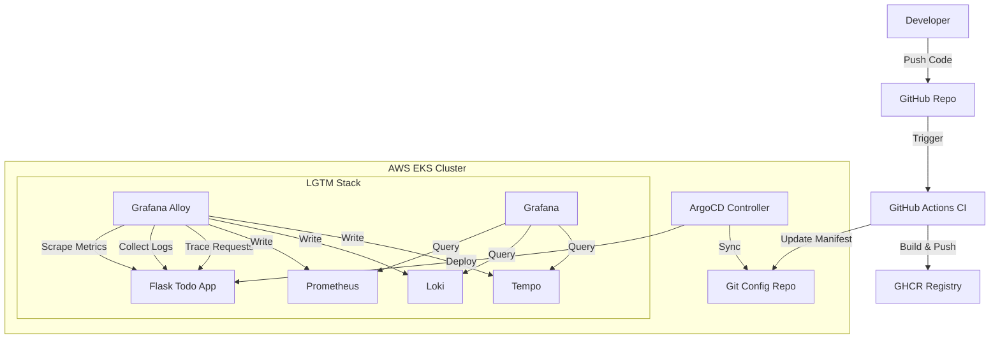

# 🚀 End-to-End DevSecOps Platform: Flask-Todo with Full Observability


## 🌟 Project Overview

Welcome to the **Flask-Todo DevSecOps Platform**! This project is a state-of-the-art demonstration of a modern, production-ready cloud-native architecture. It orchestrates the full software lifecycle of a Python Flask application, from code commit to deployment, monitoring, and tracing.

It leverages the **LGTM Stack** (Loki, Grafana, Tempo, Mimir/Prometheus) alongside **Grafana Alloy** for a complete observability solution, ensuring you have deep insights into metrics, logs, and distributed traces.

---

## 🏗️ Architecture & Telemetry Flow

The platform is designed with a "GitOps-first" approach, ensuring infrastructure and application state are always synchronized with the code.



### 🧩 Key Components

| Component | Technology | Description |
| :--- | :--- | :--- |
| **Application** | Python / Flask | A RESTful To-Do app instrumented with OpenTelemetry. |
| **Infrastructure** | Terraform | Automates AWS EKS cluster, VPC, and networking setup. |
| **CI/CD** | GitHub Actions | Builds Docker images and updates Helm/K8s manifests. |
| **GitOps** | ArgoCD | Automatically syncs application state from Git to EKS. |
| **Metrics** | Prometheus | Scrapes application and infrastructure metrics (RPS, Latency). |
| **Logs** | Loki | Aggregates structured logs from the application. |
| **Traces** | Tempo | Provides distributed tracing for request visualization. |
| **Collector** | Grafana Alloy | The unified agent for collecting all telemetry data. |

---

## 📊 Observability: The "Very Good" Dashboards

We have implemented a **Gold Standard** observability suite. When you deploy, Grafana is automatically provisioned with the following dashboards:

### 1. 📈 Prometheus (Metrics)
*   **Request Rates (RPS)** broken down by route and method.
*   **Error Rates** to instantly spot 500s.
*   **Latency Histograms** (p95, p99) to track performance bottlenecks.
*   **Database Operations** tracking SQL query frequency.

### 2. 📝 Loki (Logs)
*   **Real-time Log Streaming** directly in your dashboard.
*   **Error Log Aggregation** to filter noise and focus on failures.
*   **Log Volume Analysis** to detect spikes in activity.

### 3. ⏱️ Tempo (Traces & Service Graph)
*   **Service Graph**: Generated automatically from traces using the Metrics Generator.
*   **Trace Search**: Find specific requests by ID or attributes.
*   **Span Metrics**: Deep dive into the latency of specific code paths (e.g., specific SQL queries).

---

## 🚀 Getting Started

### Prerequisites
*   AWS CLI configured with appropriate permissions.
*   Terraform installed.
*   `kubectl` and `helm` installed.

### 1. Provision Infrastructure
Deploy the AWS EKS cluster using Terraform:
```bash
cd terraform
terraform init
terraform apply --auto-approve
```

### 2. Bootstrap Observability
Run the automated workflow or deploy manually:
```bash
# Using the provided helper script
./scripts/deploy_observability.sh

# OR manually via Helm
helm install alloy grafana/alloy -f helm/alloy-values.yaml -n observability
```

### 3. Deploy Application (GitOps)
ArgoCD will automatically pick up changes. You can check the sync status:
```bash
kubectl get application my-app -n argocd
```

---

## 📂 Project Structure

```text
.
├── .github/workflows/   # CI/CD Pipelines (Deploy, Observability, Terraform)
├── argocd/              # ArgoCD Applications and Manifests
├── flask-todo/          # Source code for the Python Application
├── helm/                # Helm charts for Observability Stack (Alloy, Loki, Tempo)
│   ├── dashboards/      # JSON definitions for Grafana Dashboards
│   ├── alloy-values.yaml
│   └── ...
├── terraform/           # IaC for AWS EKS
└── README.md            # The documentation you are reading
```

---

## 🛠️ Maintenance & Troubleshooting

*   **Secrets Management**: Secrets are managed via GitHub Actions Secrets (e.g., `GHCR_SEC`, `AWS_ROLE_ARN`).
*   **Dashboard Updates**: Edit the JSON files in `helm/dashboards/` and the pipeline will automatically apply them to the cluster.

---

> Built with ❤️ by Ahmed
